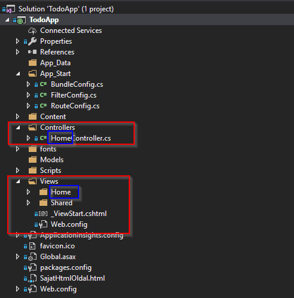

# WebesTodoApp201806
A NetAcademia "Az első webes C# projektem: TO-DO alkalmazás készítése" tanfolyam kiegészítő kódtára

## A tanfolyam célja

```
                               +------------------------+
                               |   Desktop számítógép   |
                               |                        |
                               |    +-------------+     |
+---------------+              |    |  Alkalmazás |     |
|               |              |    |             |     |
|  Felhasználó  |              |    +-------------+     |
|               |              |                        |
|               |              |                        |
+---------------+              |                        |
                               +------------------------+


    Hagyományos Desktop/Mobil alkalmazásfejlesztés

```

```
                                                                          +--------------------------+
                                                                          |  Szerver számítógép      |
                               +------------------------+                 |                          |
                               |   Desktop számítógép   |                 |                          |
                               |    Mobil eszköz        |    Hálózati     |                          |
                               |                        |    kapcsolat    | +----------------------+ |
+---------------+              |                        |                 | |                      | |
|               |              |    +-------------+     +---------------> | |  Szerver alkalmazás  | |
|  Felhasználó  |              |    | Alkalmazás  |     |                 | |  (WebSzerveren futó  | |
|               |              |    | (Böngésző)  |     | <---------------+ |  app)                | |
|               |              |    +-------------+     |                 | |                      | |
+---------------+              |                        |        ^        | +----------------------+ |
                               +------------------------+        |        |                          |
                                                                 |        |              ^           |
                                            ^                    |        |              |           |
                                            |                    |        |              |           |
                                            |                    |        |              |           |
                                            |                    |        +--------------------------+
                                            |                    |                       |
                                            +                    +                       +
                                          HTML                 HTTP                     MVC


                                               Webes Alkalmazásfejlesztés

```

## Ajánlott tanfolyamok
- HTML
  [Lenyűgöző weblapok készítése](https://app.netacademia.hu/Tanfolyam/2017htmllanding-lenyugozo-weblapok-keszitese)
- HTTP
  [Hálózati alapismeretek](https://app.netacademia.hu/Tanfolyam/HA-halozati-alapismeretek)
- GIT
  [Fedezzük fel a gitet!](https://app.netacademia.hu/Tanfolyam/git-fedezzuk-fel-a-gitet)


## Az első webes alkalmazásunk létrehozása
Mivel a környezet és a fejlesztési munkafolyamat az ilyen típusú fejlesztéseknél összetett, így nem kézzel hozzuk létre, hanem a Visula Studio template-jének a segítségével.

A varázslóval létrehozzuk az ASP.NET MVC Webalkalmazást (.NET framework), az alábbi módon:

Új projekt létrehozása:


MVC alkalmazás kiválasztása


### Saját html oldal létrehozása és kiszolgálása
Ha létrehozunk egy html állományt az alkalmazás könyvtárában, azt alapértelmezésben az ASP.NET alkalmazásunk szolgáltatja. Vagyis, ha a böngésző elkéri ezt az állományt, akkor a szerver visszaküldi neki:

Ez a kérés (a böngészőből a szerverre):
```
GET http://localhost:39399/SajatHtmlOldal.html
```

(a szerver a böngészűbe) visszaküldi a HTML oldalt (weblap):
```html
<!DOCTYPE html>
<html>
<head>
    <meta charset="utf-8" />
    <title>Ez a saját html oldalunk címe</title>
</head>
<body>
    Ez pedig a saját html oldalunk tartalma, ezt fogja a böngésző megmutatni.
</body>
</html>
```

Ez ugyanúgy működik, ha a file-t nyitjuk meg a böngészőből:
```
file:///D:/Repos/WebesTodoApp201806/TodoApp/TodoApp/SajatHtmlOldal.html
```
akkor is ugyanúgy megjeleníti.

### HTTP: Ha az állomány nem a file rendszerben van, hanem egy másik szerveren

A HTTP feladata: kéréseket megfogalmazását és a válaszok formátumát írja le, ha a hálózaton keresztül szeretnénk egy tartalmat lekérdezni.

A HTTP kérés négy részből áll
- kérés (cím+metódus)
- tartalom
- fejlécek
- végállapot

Ebből minket az első kettő érdekel.

Metódus: pl: GET, POST, PUT, DELETE, stb.
Részletek [a wikipédián](https://hu.wikipedia.org/wiki/HTTP)

Fontos még, hogy a HTTP protokol állapotot nem kezel, így a kérések egymástól teljesen független.

### MVC: Dinamikus weblapokból készített webalkalmazás
Ha nem statikus lapok egymás utánját szeretnénk megjeleníteni, hanem:
- egy jól kinéző formátumot meghatározni az összes oldalra
- saját adatokat metenni a weboldal megfelelő helyére
- az alkalmazás interakcióját megszervezni

Az egy szép feladat, erre szolgál az ASP.NET MVC.

### Konkrét feladat: TODO alkalmazás 0. változat (bevásárlólista)

```
+-----------------+
|                 |
| Bevásárlólista  |
|                 |
+-----------------+
|                 |
| Só              |
|                 |
| Cukor           |
|                 |
| Spagetti        |
|                 |
| Marhahús        |
|                 |
| Paradicsom      |
|                 |
+-----------------+
```

A megjelenítésnél 
- az adatokat kezeljük külön a weboldaltól
- a weboldalunk legyen szép

### MVC alkalmazás főbb elemei



- MVC: Model-View-Controller
  - Controller
    A kérést fogadó objektum, az ő felelőssége 
    - a kérésre a válasz létrehozása, vagy delegálása, 
    - és a válasz visszajuttatása a kérőhöz

Kérdés: hogy jut el a kérés a Controllerhez? Válasz: a kérés címe alapján.

például:

```
GET http://localhost:39399/Home/About
```

itt a cím első fele az alkalmazásra mutat:
```
http://localhost:39399
```

a cím második fele és a metódus pedig az alkalmazáson belül jelent valamit:

```
GET /Home/About
```

Ennek a feldolgozása a **Routing** (útválasztás) feladata. A címben a "/" az elválasztást jelentő jel, vagyis, ennek mentén lehet szétszedni a teljes címet *értelmes*, vagyis az **alkalmazás által feldolgozható** részekre.

Az ASP.NET MVC konvenció szerint, 
    - az **első része** ennek címnek címzi **a controllert** (a példában: Home). Controller: vezérlő
    - a második része pedig azt az **Actiont**, ami kiszolgálja a kérést. Action: függvény

Ennek a segítségével az egyes kéréseket függvényekbe tudjuk szervezni, és a függvényeket pedig vezérlő egységekbe.

Fontos, a címnek a többi része, ami az első kettő egységet (Controller/Action) követi, a kérés paramétereit fogja tartalmazni valamilyen formában.

#### A Vezérlő (Controller)

- Általában az alkalmazás Controllers mappájába tesszük, az áttekinthetőség miatt. Ez nem kötelező, de ajánlott.
- Leszármaztatjuk a Controller osztályból (kötelező) (System.Web.Mvc.Controller, ez való a webalkalmazáshoz, a weblapok generálását végző vezérlőtípus).
- Az osztály neve mindig úgy végződik, hogy Controller, de a routingban ezt nem használjuk, csak a Controller előtti részt.

Az ASP.NET MVC keretrendszer rendkívül erősen épít névkonvencióra: egy-egy elem neve meghatározó szerepet tölt be az alkalmazás működésében.

Két fontos Routing szabály van: 
    - ha az Action nincs megadva, akkor az az **Index**.
    - ha a Controller sincs megadva, akkor az a **Home/Index**

#### A Nézet (View)
Nézkonvenció alapján:

- MVC: Model-View-Controller
  - View
    Olyan nyers HTML állomány, ami képes értelmes HTML szöveget előállítani.
    Saját szabályai vannak (Razor nyelv), ami egy-egy válasz esetén lefut, és generálja a végleges HTML-t

Általában
A Controllerhez tartozó nézetek a webalkalmazásunk \Views mappájában vannak, Controllerenként csoportosítva, a csoportosító mappa neve ugyanaz, mint a Controller Routing neve.

Például: a HomeController nézetei a Views\Home mappában vannak.

És: az egyes nézet állományok neve azonos a Controller Action nevével, amihez tartoznak.

Megjegyzés: ezt a konvenciót megtörhetjük: ki is jelölhetünk egy Action-höz egy meghatározott View-t.

Vagyis, a HomeController.TodoList() action-höz automatikusan tartozó nézet itt van: \Views\Home\TodoList.cshtml

A HTML kód írásához [ezt a tutorialt](https://www.w3schools.com/Html) használhatjuk.

A nézet képes definiálni az adatmodell típusát, amin dolgozik.

- MVC: Model-View-Controller
  - Model
    Az adatokat tartalmazó objektum, ami a Controller és a View között az adatokat szállítja


